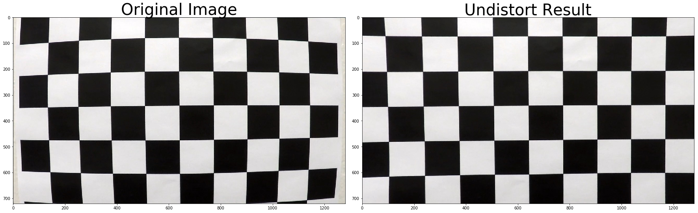
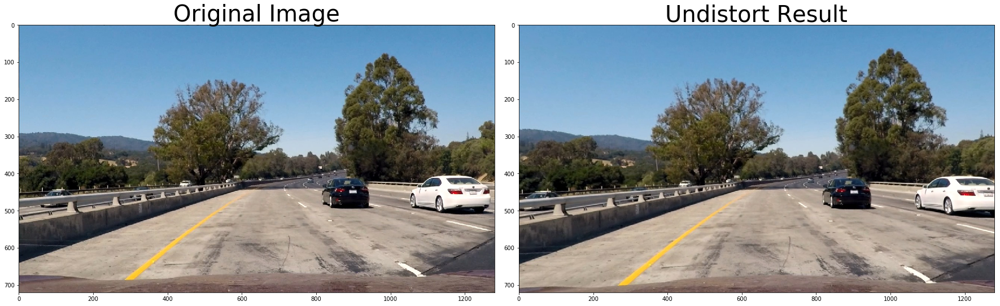
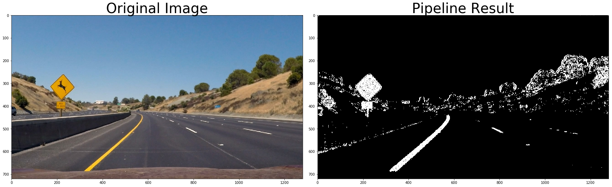
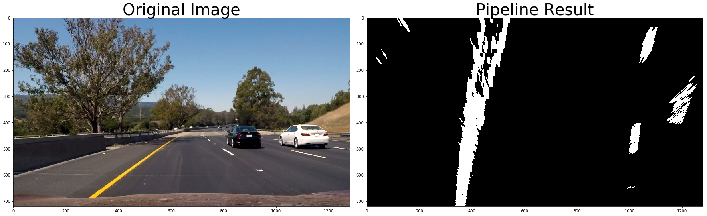
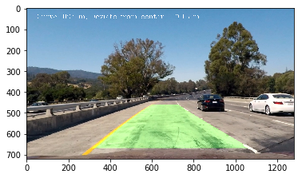

## Writeup Template

### You can use this file as a template for your writeup if you want to submit it as a markdown file, but feel free to use some other method and submit a pdf if you prefer.

---

**Advanced Lane Finding Project**

The goals / steps of this project are the following:

* Compute the camera calibration matrix and distortion coefficients given a set of chessboard images.
* Apply a distortion correction to raw images.
* Use color transforms, gradients, etc., to create a thresholded binary image.
* Apply a perspective transform to rectify binary image ("birds-eye view").
* Detect lane pixels and fit to find the lane boundary.
* Determine the curvature of the lane and vehicle position with respect to center.
* Warp the detected lane boundaries back onto the original image.
* Output visual display of the lane boundaries and numerical estimation of lane curvature and vehicle position.

### Camera Calibration

#### 1. Briefly state how you computed the camera matrix and distortion coefficients. Provide an example of a distortion corrected calibration image.

Fisrt prepare "object points", according to nx and ny which is 9x6 for all our chessboards.

Then for every image used for calibration, use cv2.findChessboardCorners function to attempt to find corners. If successful, add object points and image points accordingly.

Finally, apply cv2.calibrateCamera function and get the matrix and distortion coefficients.

### Pipeline (single images)

#### 1. Provide an example of a distortion-corrected image.

To demonstrate this step, I will describe how I apply the distortion correction to one of the test images like this one:

#### 2. Describe how (and identify where in your code) you used color transforms, gradients or other methods to create a thresholded binary image.  Provide an example of a binary image result.

Class Color_Grad_Pipeline is defined to apply these transforms. S channel from HLS is used so that it's more robust. Sobel gradient direction and magnitude are used, as well as the s channel color threshold is applied.

#### 3. Describe how (and identify where in your code) you performed a perspective transform and provide an example of a transformed image.

Class Perspective_Transform is defined to apply perspective transform.

After the transformation, parallel car lanes are observed in warped images.

#### 4. Describe how (and identify where in your code) you identified lane-line pixels and fit their positions with a polynomial?

Class Lane_Finder is defined to identify lane pixels, apply polynomial fit and calculate curvature. Here I used sliding window method described in lectures.

#### 5. Describe how (and identify where in your code) you calculated the radius of curvature of the lane and the position of the vehicle with respect to center.

The code is in Lane_Finder.process. It calcuates curvature and perform sanity check.

#### 6. Provide an example image of your result plotted back down onto the road such that the lane area is identified clearly.

There is a class created for the entire pipeline. Here's an example output.

---

### Pipeline (video)

#### 1. Provide a link to your final video output.  Your pipeline should perform reasonably well on the entire project video (wobbly lines are ok but no catastrophic failures that would cause the car to drive off the road!).

Here's a [link to my video result](./output.mp4)

---

### Discussion

#### 1. Briefly discuss any problems / issues you faced in your implementation of this project.  Where will your pipeline likely fail?  What could you do to make it more robust?

The pipeline is likely to fail if road lanes are not clear for a long distance and the lane is changing a lot. Perhaps some lane prediction techniques would make this more robust.

Also, for perspective transform, the points are hand chosen. I hope there is some way to automate the process and make it more robust.
